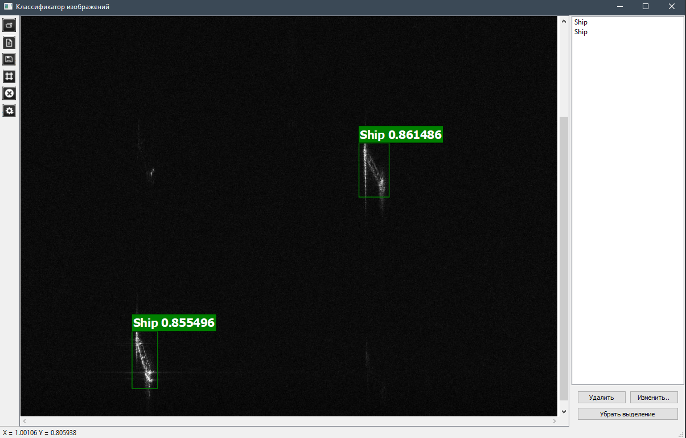
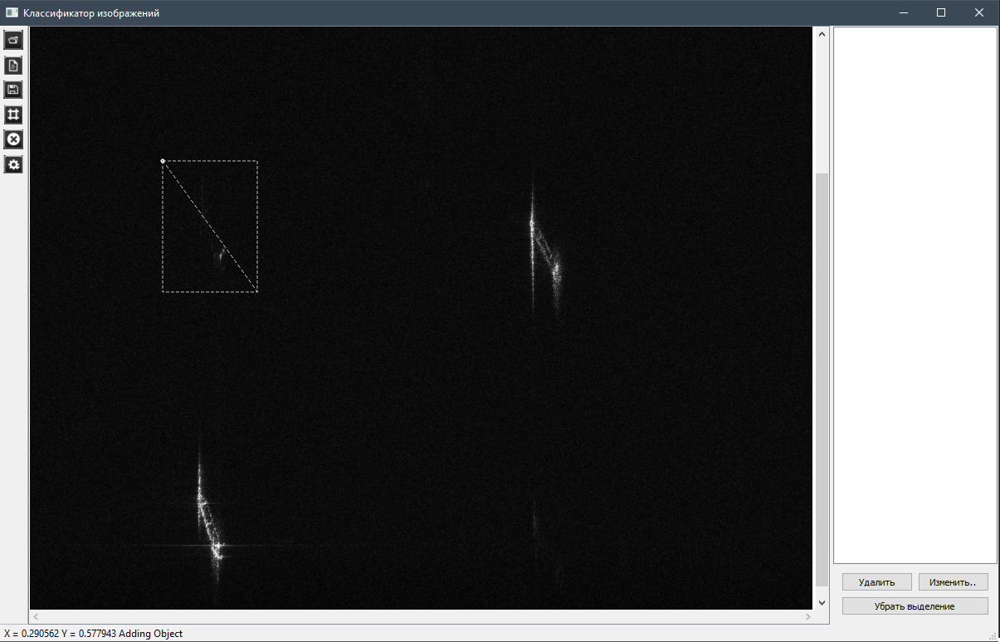
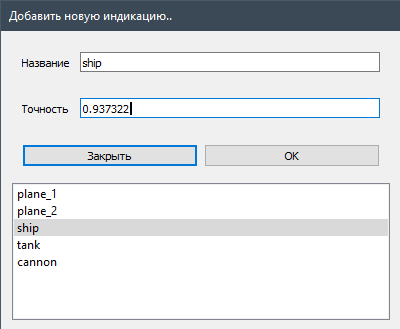

# ImageLabelTool
Приложение для ручной маркировки объектов на РЛИ
## Главное окно приложения
Графический интерфейс состоит из панели инструментов, основного окна, и панели существующих индикаций.

## Добавление новой индикации 
Нажав на кнопку "Создать индикацию" на панели инструментов, включится режим добавления новой индикации

Далее при нажатии левой кнопки мыши на основное окно приложения, пользователь может создать начальную точку новой индикации, и при перетаскивании курсора, область будет меняться. 

После чего пользователь может ещё раз нажать на левую кнопку мыши, и тогда появится окно выбора параметров для новой индикации.

Затем, после ввода всех необходимых данных, индикация отобразится в основном окне и информация выводится на панель существующих индикаций.

## Открытие/Сохранение индикаций
Также можно открыть существующие индикации из .txt файла, а также сохранить текущую конфигурацию как изображение (.png, jpg) и данные об индикации в виде .txt файла  
